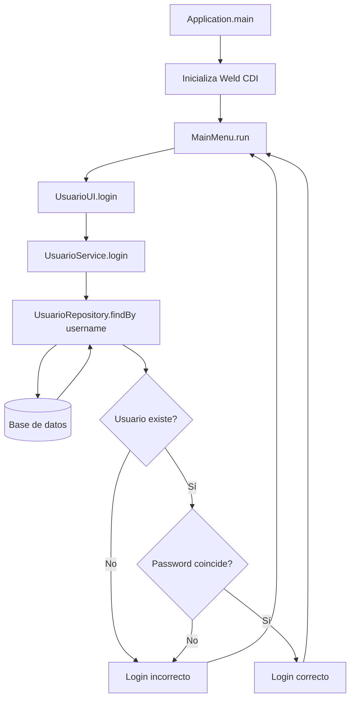

# 🚀 Primeros pasos

## 🧰 Tipo de proyecto en IntelliJ
- ✅ Java con Maven
- ✅ Java 25 de Microsoft OpenJDK (valdría cualquier otra versión de Java 25)
- ✅ Con Git activado

## 🏗️ Estructura del proyecto
- 📁 `src/main/java`: código fuente de la aplicación
- 📁 `src/main/resources`: recursos de la aplicación (archivos de configuración, plantillas, etc.)
- 📦 `common`: código común a todos los módulos (si hubiera varios módulos)
- 🗄️ `dao`: capa de acceso a datos
  - `repositories`: repositorios de datos (interfaces que extienden de `JpaRepository`)
  - `mappers`: mapeadores de datos procedentes de la base de datos a objetos DAO (si fuera necesario)
  - `model`: modelos de datos, entidades que representan tablas de la base de datos
- 🧠 `domain`: capa de dominio
  - `services`: capa de servicios (lógica de negocio)
  - `dto` o `model`: objetos de transferencia de datos (Data Transfer Objects)
  - `mappers`: mapeadores de datos entre entidades y DTOs
  - `error` o `exceptions`: clases de error y excepciones personalizadas
- 🖥️ `ui`: capa de presentación (controladores, vistas, etc.)
- ▶️ `Application.java`: punto de entrada de la aplicación

## 📚 Librerías y dependencias (pom.xml)
- 🔹 Jakarta EE 11 Web API (del API usaremos inject, persistence, validation, etc. no necesiariamente la parte web).
- 🔹 Weld core (CDI: inyección de dependencias)
- 🔹 Lombok (para reducir el código repetitivo)
- 🔹 HikariCP (pool de conexiones a la base de datos). No es necesario en los primeros pasos, pero es recomendable tenerlo para posibles escenarios de producción.
- 🔹 MySQL Connector/J (driver JDBC para MySQL)
- 🔹 Implementación de logging (SLF4J + Logback/Log4j2)

## El fichero `resources/META-INF/beans.xml`
- 📄 `beans.xml` es el archivo de configuración de CDI (Contexts and Dependency Injection) que se encuentra en `src/main/resources/META-INF/beans.xml`.
- Lo hemos configurado con `bean-discovery-mode="all"` para que CDI escanee todos los paquetes de la aplicación y pueda inyectar dependencias automáticamente.

## 🔐 Pila de llamadas para el caso de login de usuario
1. La aplicación arranca el gestor de dependencias (Weld) y carga los beans necesarios.
2. El bean del menú principal delega en el bean de interfaz de usuario (`UsuarioUI`) para solicitar por consola el login del usuario.
3. `UsuarioUI` llama al servicio de autenticación (`UsuarioService`) para validar el login del usuario.
4. El servicio de autenticación llama al repositorio de usuarios para buscar el usuario por su nombre.
5. El repositorio de usuarios realiza la consulta a la base de datos y devuelve el usuario encontrado (o `null` si no existe).
6. El servicio de autenticación compara la contraseña proporcionada con la almacenada en la base de datos (de momento obviamos la parte de base de datos).
7. Si la autenticación es exitosa, `UsuarioUI` muestra el mensaje de bienvenida y devuelve el control del flujo al menú principal.

### Diagrama de flujo (hecho con Mermaid)

# 🎯 Qué hemos aprendido *(Learning outcomes)*
- ✅ Una posible estructura de un proyecto Java con Maven.
- ✅ Conocer las dependencias y librerías necesarias para el proyecto en este momento.
- ✅ Entender el flujo de llamadas y cómo se comunican las diferentes capas de la aplicación.
- ✅ Utilizar Lombok para reducir el código repetitivo.
- ✅ Aplicar buenas prácticas de diseño de software, como la separación de responsabilidades y la inyección de dependencias.

# 🛣️ Lo siguiente *(What's next)*
- 🔜 Implementar la base de datos y la capa de acceso a datos (DAO).
- 🔜 Implementar la capa de servicios (lógica de negocio).
- 🔜 Implementar la capa de presentación (UI) para interactuar con el usuario.
- 🔜 Usar DTOs para transferir datos entre las capas de la aplicación.
